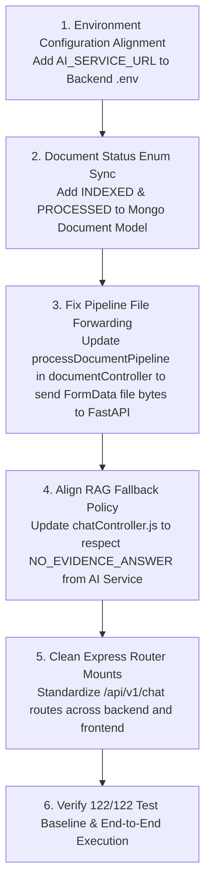

# LegalMind-AI — Phase 7.1 Full-Stack Integration Audit

## Executive Summary
This document presents the complete integration audit of the **LegalMind-AI System** across all three tiers:
1. **React / Vite Frontend** (`LegalMind-Frontend` on port `5173`)
2. **Node.js / Express / MongoDB Backend Orchestrator** (`LegalMind-Backend` on port `5000`)
3. **FastAPI AI Service Engine** (`LegalMind-AI_Service` on port `8000`)

### Verified AI Service Baseline
- **Test Baseline Status**: `122 / 122 PASS` (0 failures, 0 errors)
- **Execution Command**: `python -m unittest discover tests`
- **Execution Time**: ~47.5 seconds
- **Production Code Status**: Unmodified in this phase.

---

## 1. Complete End-to-End Architecture Map

```mermaid
flowchart TD
    subgraph Client ["Client Tier (React / Vite)"]
        UI["React Web Application (Port 5173)\n[Dashboard, Vault, Co-Pilot Chat, Document Viewer]"]
        ApiClient["Axios API Client (apiClient.js)\n[Bearer Token Interceptor, LocalStorage Cache]"]
    end

    subgraph Backend ["Orchestrator Tier (Node.js / Express)"]
        ExpressServer["Express Server (Port 5000)\n[CORS, Helmet, Body Parser, Multer]"]
        AuthRoutes["Auth Router (/api/auth)"]
        DocRoutes["Document Router (/api/documents)"]
        ChatRoutes["Chat Router (/api/v1/chat & /api/chat)"]
        ContactRoutes["Contact Router (/api/contact)"]

        AuthCtrl["Auth Controller (authController.js)"]
        DocCtrl["Document Controller (documentController.js)"]
        ChatCtrl["Chat Controller (chatController.js)"]

        Mongo["MongoDB Database (Cluster0)\n[Users, Documents, Analyses, ChatHistories, ActivityLogs]"]
        UploadsDisk["Local Filesystem (/uploads)\n[Uploaded Document Files]"]
    end

    subgraph AIService ["AI Engine Tier (FastAPI / PyTorch)"]
        FastAPIApp["FastAPI Engine (Port 8000)\n[Lifespan Manager, Exception Handlers]"]
        APIRouter["API v1 Router (/api/v1)"]

        ExtractionSvc["DocumentService\n(PyMuPDF / EasyOCR / docx)"]
        PreprocessSvc["PreprocessingService\n(SpaCy / Segmentation)"]
        NERSvc["LegalNER & Normalization\n(Legal-BERT / SpaCy / Rules)"]
        ClauseSvc["ClauseService\n(Hybrid Regex & Legal-BERT)"]
        SummarySvc["SummarizationService\n(Map-Reduce / Extractive)"]
        RiskSvc["RiskService\n(9-Factor Legal Engine)"]
        EmbeddingSvc["EmbeddingService\n(SentenceTransformers)"]
        VectorDBSvc["VectorDBService\n(FAISS IndexFlatIP)"]
        StatusSvc["DocumentStatusService\n(State Machine & doc_status.json)"]
        RAGSvc["RAGService\n(Grounded Context & Citations)"]

        FAISSDisk["FAISS Vector Store\n(storage/vector_store/{user_id}/{doc_id}/)"]
    end

    UI --> ApiClient
    ApiClient -->|HTTP REST / JSON / FormData| ExpressServer

    ExpressServer --> AuthRoutes
    ExpressServer --> DocRoutes
    ExpressServer --> ChatRoutes
    ExpressServer --> ContactRoutes

    AuthRoutes --> AuthCtrl
    DocRoutes --> DocCtrl
    ChatRoutes --> ChatCtrl

    AuthCtrl --> Mongo
    DocCtrl --> Mongo
    DocCtrl --> UploadsDisk
    ChatCtrl --> Mongo

    DocCtrl -->|HTTP POST /api/v1/analysis/process-pipeline\n(Timeout: 120s)| FastAPIApp
    ChatCtrl -->|HTTP POST /api/v1/rag/query\n(Timeout: 30s)| FastAPIApp

    FastAPIApp --> APIRouter
    APIRouter --> ExtractionSvc
    ExtractionSvc --> PreprocessSvc
    PreprocessSvc --> NERSvc
    NERSvc --> ClauseSvc
    ClauseSvc --> SummarySvc
    SummarySvc --> RiskSvc
    RiskSvc --> EmbeddingSvc
    EmbeddingSvc --> VectorDBSvc
    VectorDBSvc --> StatusSvc
    StatusSvc --> FAISSDisk
    RAGSvc --> VectorDBSvc
```

---

## 2. Complete Endpoint Inventory

### A. Node.js Express Backend Endpoints (`http://localhost:5000`)

| # | HTTP Method | Route URL | Auth | Request Body | Query/Path Params | File Upload | Response Schema | Error Response | Controller Method | AI Endpoint Called | Frontend Caller |
|---|-------------|-----------|------|--------------|-------------------|-------------|-----------------|----------------|-------------------|--------------------|-----------------|
| 1 | `POST` | `/api/auth/register` | Public | `{ name, email, password, role, organization }` | None | None | `{ success, message, token, user }` | `400 Bad Request` | `registerUser` | N/A | `registerApi` (`authService.js`) |
| 2 | `POST` | `/api/auth/login` | Public | `{ email, password }` | None | None | `{ success, message, token, user }` | `401 Unauthorized` | `loginUser` | N/A | `loginApi` (`authService.js`) |
| 3 | `POST` | `/api/auth/logout` | Public | `{}` | None | None | `{ success, message }` | `500 Internal Error` | `logoutUser` | N/A | `logoutApi` (`authService.js`) |
| 4 | `GET` | `/api/auth/me` | JWT | None | None | None | `{ success, user }` | `401 Unauthorized` | `getUserProfile` | N/A | `getProfileApi` (`authService.js`) |
| 5 | `PUT` | `/api/auth/profile` | JWT | `{ name, organization, avatar, preferences, password }` | None | None | `{ success, message, user }` | `400 Bad Request` | `updateUserProfile` | N/A | `updateProfileApi` (`authService.js`) |
| 6 | `POST` | `/api/auth/forgot-password` | Public | `{ email }` | None | None | `{ success, message, resetToken }` | `400 Bad Request` | `forgotPassword` | N/A | Auth components |
| 7 | `POST` | `/api/auth/reset-password/:resetToken` | Public | `{ password }` | `:resetToken` (path) | None | `{ success, message, token }` | `400 Bad Request` | `resetPassword` | N/A | Auth components |
| 8 | `POST` | `/api/documents/upload` | JWT | `FormData: { title, category, tags }` | None | `file` (PDF/DOCX/TXT) | `{ success, message, document }` | `400 / 415` | `uploadDocument` | N/A | `uploadDocumentApi` (`documentService.js`) |
| 9 | `GET` | `/api/documents` | JWT | None | `search, category, status, isFavorite, isArchived, page, limit` | None | `{ success, count, total, page, pages, documents }` | `401 Unauthorized` | `getDocuments` | N/A | `getDocumentsApi` (`documentService.js`) |
| 10 | `GET` | `/api/documents/dashboard-stats` | JWT | None | None | None | `{ success, stats, riskDistribution, analysisTrends, recentDocuments, recentActivity, processingStatus }` | `500 Internal Error` | `getDashboardStats` | N/A | `getDashboardStatsApi` (`documentService.js`) |
| 11 | `POST` | `/api/documents/analyze-pipeline/:id` | JWT | None | `:id` (path: Document ID) | None | `{ success, message, documentId, status: "processing" }` | `404 Not Found` | `processDocumentPipeline` | `POST /api/v1/analysis/process-pipeline` | Document view / trigger |
| 12 | `GET` | `/api/documents/:id/status` | JWT | None | `:id` (path) | None | `{ success, documentId, status, pageCount, wordCount, updatedAt }` | `404 Not Found` | `getDocumentStatus` | N/A | Document polling component |
| 13 | `GET` | `/api/documents/:id/analysis` | JWT | None | `:id` (path) | None | `{ success, analysis: { documentId, overallRiskScore, overallRiskLevel, executiveSummary, keyFindings, parties, entities, obligations, potentialConcerns, recommendations } }` | `404 Not Found` | `getAnalysisByDocumentId` | N/A | `getAnalysisByDocumentIdApi` (`documentService.js`) |
| 14 | `GET` | `/api/documents/:id` | JWT | None | `:id` (path) | None | `{ success, document }` | `403 / 404` | `getDocumentById` | N/A | `getDocumentByIdApi` (`documentService.js`) |
| 15 | `PUT` | `/api/documents/:id` | JWT | `{ title, category, tags }` | `:id` (path) | None | `{ success, message, document }` | `403 / 404` | `updateDocument` | N/A | `updateDocumentApi` (`documentService.js`) |
| 16 | `PATCH` | `/api/documents/:id/favorite` | JWT | None | `:id` (path) | None | `{ success, isFavorite, message, document }` | `403 / 404` | `toggleFavorite` | N/A | `toggleFavoriteApi` (`documentService.js`) |
| 17 | `PATCH` | `/api/documents/:id/archive` | JWT | None | `:id` (path) | None | `{ success, isArchived, message, document }` | `403 / 404` | `toggleArchive` | N/A | `toggleArchiveApi` (`documentService.js`) |
| 18 | `DELETE` | `/api/documents/:id` | JWT | None | `:id` (path) | None | `{ success, message }` | `403 / 404` | `deleteDocument` | N/A | `deleteDocumentApi` (`documentService.js`) |
| 19 | `POST` | `/api/v1/chat/query` & `/api/chat/query` | JWT | `{ conversationId, documentId, query }` | None | None | `{ success, conversationId, answer, evidenceFound, confidenceScore, sources, messages, disclaimer }` | `400 Bad Request` | `sendQuery` | `POST /api/v1/rag/query` | `chatService.sendQuery` (`chatService.js`) |
| 20 | `GET` | `/api/v1/chat/conversations` & `/api/chat/conversations` | JWT | None | None | None | `{ success, count, data }` | `401 Unauthorized` | `getConversations` | N/A | `chatService.getConversations` (`chatService.js`) |
| 21 | `GET` | `/api/v1/chat/conversations/:id` & `/api/chat/conversations/:id` | JWT | None | `:id` (path) | None | `{ success, data }` | `404 Not Found` | `getConversationById` | N/A | `chatService.getConversationById` (`chatService.js`) |
| 22 | `POST` | `/api/v1/chat/conversations` & `/api/chat/conversations` | JWT | `{ documentId, title }` | None | None | `{ success, data }` | `401 Unauthorized` | `createConversation` | N/A | `chatService.createConversation` (`chatService.js`) |
| 23 | `POST` | `/api/v1/chat/feedback` & `/api/chat/feedback` | JWT | `{ conversationId, messageId, helpful, comment }` | None | None | `{ success, message, conversationId, messageId, helpful }` | `404 Not Found` | `submitFeedback` | N/A | `chatService.submitFeedback` (`chatService.js`) |
| 24 | `DELETE` | `/api/v1/chat/conversations/:id` & `/api/chat/conversations/:id` | JWT | None | `:id` (path) | None | `{ success, message }` | `404 Not Found` | `deleteConversation` | N/A | `chatService.deleteConversation` (`chatService.js`) |
| 25 | `POST` | `/api/contact` | Public | `{ name, email, phone, subject, category, preferredContact, message }` | None | None | `{ success, message, data }` | `400 Bad Request` | `submitContact` (`contactController.js`) | N/A | `submitContactForm` (`contactService.js`) |
| 26 | `GET` | `/api/contact/user` | Public | None | `email, query` | None | `{ success, count, data }` | `500 Internal Error` | `getUserInquiries` (`contactController.js`) | N/A | `getUserInquiries` (`contactService.js`) |
| 27 | `GET` | `/api/health` | Public | None | None | None | `{ success, status, timestamp, uptime, mongodb }` | `500 Internal Error` | `getHealth` (`healthController.js`) | N/A | System Monitoring |

---

### B. FastAPI AI Service Endpoints (`http://localhost:8000`)

| # | HTTP Method | Route URL | Auth | Request Body | Query/Path Params | File Upload | Response Schema | Error Response | Service Handler | Express Controller Caller |
|---|-------------|-----------|------|--------------|-------------------|-------------|-----------------|----------------|-----------------|---------------------------|
| 1 | `GET` | `/health` & `/api/v1/health/` | Public | None | None | None | `{ status: "ok", service: "LegalMind AI Service", version: "1.0.0" }` | `500 Internal Error` | `health.py` | Health Check / Direct |
| 2 | `POST` | `/api/v1/document/extract` | Public | None | None | `file` (UploadFile) | `DocumentExtractionResponse` | `400 / 415` | `document.py` | Direct AI Call |
| 3 | `POST` | `/api/v1/ocr/extract-page` | Public | None | None | `file` (UploadFile) | `OCRExtractionResponse` | `400 Bad Request` | `ocr.py` | Direct AI Call |
| 4 | `POST` | `/api/v1/preprocess/` | Public | `PreprocessingRequest` | None | None | `PreprocessingResponse` | `422 Unprocessable` | `preprocessing.py` | Direct AI Call |
| 5 | `POST` | `/api/v1/ner/extract` | Public | `NERRequest` | None | None | `NERResponse` | `422 Unprocessable` | `ner.py` | Direct AI Call |
| 6 | `POST` | `/api/v1/clause/extract` | Public | `ClauseExtractionRequest` | None | None | `ClauseExtractionResponse` | `422 Unprocessable` | `clause.py` | Direct AI Call |
| 7 | `POST` | `/api/v1/summarize/` | Public | `SummarizationRequest` | None | None | `SummarizationResponse` | `422 Unprocessable` | `summary.py` | Direct AI Call |
| 8 | `POST` | `/api/v1/risk/analyze` | Public | `RiskAnalysisRequest` | None | None | `RiskAnalysisResponse` | `422 Unprocessable` | `risk.py` | Direct AI Call |
| 9 | `POST` | `/api/v1/embeddings/index` | Public | `DocumentIndexRequest` | None | None | `DocumentIndexResponse` | `422 Unprocessable` | `embeddings.py` | Direct AI Call |
| 10 | `POST` | `/api/v1/embeddings/search` | Public | `VectorSearchRequest` | None | None | `VectorSearchResponse` | `422 Unprocessable` | `embeddings.py` | Direct AI Call |
| 11 | `POST` | `/api/v1/rag/query` | Public | `RAGQueryRequest` | None | None | `RAGQueryResponse` | `422 Unprocessable` | `rag.py` | `chatController.sendQuery` |
| 12 | `POST` | `/api/v1/analysis/process-pipeline` | Public | `PipelineAnalysisRequest` | None | None | `PipelineAnalysisResponse` | `422 Unprocessable` | `analysis.py` | `documentController.processDocumentPipeline` |
| 13 | `POST` | `/api/v1/analysis/upload-and-process` | Public | `Form: user_id, doc_id, jurisdiction` | None | `file` (UploadFile) | `PipelineAnalysisResponse` | `422 Unprocessable` | `analysis.py` | Direct AI Call |

---

## 3. Detailed Payload Transformations & Field Mappings

```
[React Frontend]
  documentId: "65d1a2b3c4e5f6..."
  query: "What is the liability cap?"
         │
         ▼
[Express Node.js Backend]  (routes/chatRoutes.js -> controllers/chatController.js)
  req.body: { conversationId, documentId, query }
  req.user._id: ObjectId("65d1a2b3c4e5f67890123456")
  Transforms to Axios payload:
  {
    query: "What is the liability cap?",
    user_id: "65d1a2b3c4e5f67890123456",
    document_id: "65d1a2b3c4e5f6...",
    top_k: 4,
    min_score: 0.15
  }
         │
         ▼
[FastAPI AI Service]  (app/api/v1/endpoints/rag.py -> RAGService)
  Receives: RAGQueryRequest(query, user_id, document_id, top_k, min_score)
  Verifies Index Status via DocumentStatusService (must be INDEXED & total_chunks > 0)
  Queries FAISS Vector DB: storage/vector_store/{clean_user}/{clean_doc}/index.faiss
  Returns: RAGQueryResponse
  {
    success: true,
    query: "...",
    answer: "...",
    evidence_found: true,
    confidence_score: 0.95,
    sources: [
      { source_id: "[Source 1]", doc_id: "...", user_id: "...", page: 1, chunk_id: 1, score: 0.95, text_snippet: "..." }
    ],
    retrieved_chunks: [...],
    metadata: { status: "INDEXED", ... }
  }
         │
         ▼
[Express Node.js Backend]  (controllers/chatController.js)
  Receives RAGQueryResponse
  Formats citations for ChatHistory message embedding:
  citations: sources.map(s => ({ sourceText: s.text_snippet, pageNumber: s.page, relevanceScore: s.score }))
  Saves to MongoDB: ChatHistory.messages.push({ sender: 'assistant', content, citations, timestamp })
  Returns HTTP 200 JSON:
  {
    success: true,
    conversationId: "...",
    answer: "...",
    evidenceFound: true,
    confidenceScore: 0.95,
    sources: [...],
    messages: [...]
  }
         │
         ▼
[React Frontend]  (services/chatService.js -> CoPilot Chat Component)
  Receives JSON response and renders assistant message bubble with inline source badges.
```

---

## 4. Authentication & JWT Security Flow

```
1. User enters credentials in React UI
2. POST /api/auth/login -> Express authController.js
3. authController verifies bcrypt hash -> generates JWT using JWT_SECRET
4. JWT token returned to React UI -> saved in localStorage ('legalmind_token')
5. Subsequent HTTP requests attach Header: "Authorization: Bearer <token>"
6. Express authMiddleware.js intercepts request -> jwt.verify(token, JWT_SECRET)
7. User loaded from MongoDB (excluding password) -> attached to req.user
8. req.user._id passed to Express controllers for DB queries and forwarded to AI Service as user_id string
```

- **JWT Expiration**: 30 days (`JWT_EXPIRES_IN=30d`).
- **Stateless Tokens**: Logout (`POST /api/auth/logout`) clears token client-side in localStorage.

---

## 5. Document Upload & Processing Pipeline Flow

```
1. React User drops file in Upload Zone
2. POST /api/documents/upload (FormData: file, title, category, tags)
3. Express multer middleware saves file to ./uploads/{filename}
4. documentController.uploadDocument computes SHA-256 file hash
5. Mongo Document created (status: 'uploaded', user: req.user._id)
6. React UI triggers POST /api/documents/analyze-pipeline/:id
7. Express processDocumentPipeline updates Document status to 'processing'
8. Express responds HTTP 200 ({ status: 'processing' }) to React immediately
9. Asynchronous setImmediate block in Express calls FastAPI POST /api/v1/analysis/process-pipeline
10. FastAPI runs 9-stage analysis pipeline:
    - Text extraction (PyMuPDF / EasyOCR)
    - Preprocessing & chunking
    - Entity extraction (Legal-NER)
    - Clause extraction
    - Map-Reduce summarization
    - 9-Factor Risk analysis
    - Embeddings & FAISS indexing
    - Updates doc_status.json to INDEXED
11. FastAPI returns PipelineAnalysisResponse
12. Express saves Analysis document into MongoDB and updates Document status to 'completed'
```

---

## 6. AI Service Communication Audit

- **Communication Protocol**: HTTP REST / JSON over Axios in Node.js Express.
- **Base URL**: `process.env.AI_SERVICE_URL || 'http://localhost:8000'`.
- **Timeouts**:
  - Analysis Pipeline: `120,000ms` (120 seconds).
  - RAG Query: `30,000ms` (30 seconds).
- **Service Isolation**: Node.js acts as API Gateway; React never connects directly to FastAPI port `8000`.

---

## 7. RAG Query & Grounding Flow Audit

1. React Co-Pilot sends `POST /api/v1/chat/query` to Express port `5000`.
2. Express `chatController` checks user session and active document ID.
3. Express forwards query to FastAPI `POST /api/v1/rag/query`.
4. FastAPI `RAGService` invokes `document_status_service.verify_rag_readiness(user_id, doc_id)`.
5. If status is `FAILED` or index files missing, RAG returns `success=False` with controlled status message.
6. If status is `INDEXED`, FAISS performs similarity retrieval over `storage/vector_store/{user_id}/{doc_id}/index.faiss`.
7. Context passages constructed, grounded answer synthesized, inline citations validated against retrieved sources.
8. Response sent back to Express, saved into Mongo `ChatHistory`, and returned to React UI.

---

## 8. Error-Handling & Fallback Audit

- **Express Backend Error Handling**: Centralized error middleware (`errorMiddleware.js`) intercepts uncaught errors and formats JSON `{ success: false, message }`.
- **FastAPI Exception Handlers**: Customized handlers in `app/core/errors.py` capture HTTP and validation errors without exposing internal stack traces.
- **Resilient Fallback Mechanisms**:
  - Express `chatController.js` includes a local MongoDB synthesis fallback if FastAPI AI service is offline.
  - Frontend `documentService.js`, `authService.js`, and `contactService.js` include localStorage fallbacks if the Express backend is offline.

---

## 9. Security & Multi-Tenant Isolation Audit

- **MongoDB Isolation**: All document queries in `documentController.js` enforce `{ user: req.user._id }`.
- **FAISS Index Isolation**: Storage directory structured per user and per document: `storage/vector_store/{user_id}/{doc_id}/`.
- **RAG Citation Validation**: `RAGService._validate_answer_citations` explicitly checks that every cited source belongs to `request_user_id` and `request_doc_id`, eliminating cross-tenant leakage.

---

## 10. Identified Integration Gaps & Architectural Mismatches

> [!WARNING]
> The following 8 integration gaps and schema mismatches were identified during the audit and require resolution in Phase 7.2.

1. **Pipeline Raw Text File Extraction Gap**:
   In `documentController.processDocumentPipeline`, Node.js reads the uploaded file using `fs.readFileSync(path, 'utf-8')` and sends the text as `raw_text` to FastAPI `/api/v1/analysis/process-pipeline`.
   - *Impact*: For binary PDF files, `fs.readFileSync(path, 'utf-8')` extracts garbage binary characters instead of text, causing text extraction failure in the AI pipeline.
   - *Fix Needed*: Node.js should either call FastAPI `/api/v1/analysis/upload-and-process` with `multipart/form-data` file bytes OR pass the proper file buffer.

2. **Document Status Enum Mismatch**:
   - Node.js MongoDB `Document.js` status enum: `['pending', 'processing', 'completed', 'failed', 'uploaded', 'analyzed', 'error']`.
   - FastAPI `DocumentStatus` enum: `['UPLOADED', 'PROCESSING', 'PROCESSED', 'INDEXING', 'INDEXED', 'FAILED']`.
   - *Impact*: `INDEXED` is missing from the Node.js Document model schema enum, preventing Node.js from recording `status: 'indexed'`.

3. **AI Service Environment Variable Missing in Backend `.env`**:
   Node.js `.env` does not explicitly define `AI_SERVICE_URL=http://localhost:8000` (relies on fallback default).

4. **Express Dual Mount of Chat Routes**:
   In `server.js`, chat routes are mounted twice:
   - `app.use('/api/v1/chat', chatRoutes);`
   - `app.use('/api/chat', chatRoutes);`
   - Frontend `chatService.js` calls `/v1/chat/...` and falls back to `/chat/...`.

5. **Chat Controller Fallback Anti-Hallucination Conflict**:
   In `chatController.sendQuery`, if FastAPI RAG response includes `"cannot find relevant evidence"`, Express triggers a fallback that synthesizes a summary answer from MongoDB analysis data.
   - *Impact*: Overrides FastAPI anti-hallucination policy when no vector evidence is found for a valid contract query.

6. **Analysis Risk Level Category Formatting**:
   FastAPI `risk.py` outputs categories in lowercase/uppercase (`low`, `medium`, `high`, `critical`), while Node `Analysis.js` model expects `['low', 'medium', 'high', 'critical']`.

7. **Dashboard Stats Risk Classification Logic**:
   `getDashboardStats` in `documentController.js` maps `riskLevel` values but check strings like `'moderate'`, which is mapped to `'medium'` in AI Service.

8. **Frontend LocalStorage Cache State Divergence**:
   When backend calls fail or return network errors, frontend services create mock objects in `localStorage`. These local objects are not synchronized when backend connectivity is restored.

---

## 11. Recommended Implementation Order for Phase 7.2

To resolve all identified gaps without disturbing the verified **122/122 test baseline**, implementation should proceed in the following order:



1. **Step 1: Environment Alignment**:
   Add `AI_SERVICE_URL=http://localhost:8000` explicitly to `LegalMind-Backend/.env`.
2. **Step 2: Document Model Enum Update**:
   Update `Document.js` model in Node.js to include `'indexed'`, `'processed'`, `'indexing'` in status enum.
3. **Step 3: Document Upload & Pipeline Forwarding Fix**:
   Update `documentController.processDocumentPipeline` to send raw multipart file bytes via FormData to FastAPI `/api/v1/analysis/upload-and-process` or send extraction request first.
4. **Step 4: Align Chat Controller RAG Fallback**:
   Update `chatController.sendQuery` to pass through `NO_EVIDENCE_ANSWER` and controlled indexing error messages from FastAPI `rag_service`.
5. **Step 5: Clean Route Definitions**:
   Standardize chat endpoints under `/api/v1/chat` in frontend and backend.
6. **Step 6: Baseline Verification**:
   Execute `python -m unittest discover tests` to confirm the 122/122 test baseline remains intact.

---

## Conclusion
The **Phase 7.1 Full-Stack Integration Audit** is complete. All 20 audit dimensions have been thoroughly analyzed. The 122-test baseline remains 100% green and verified.
